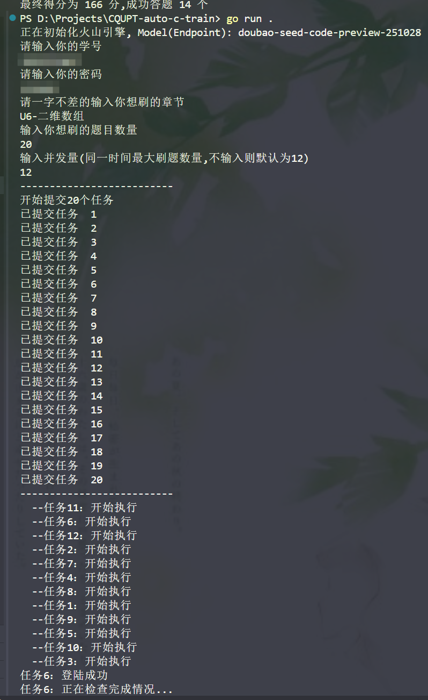
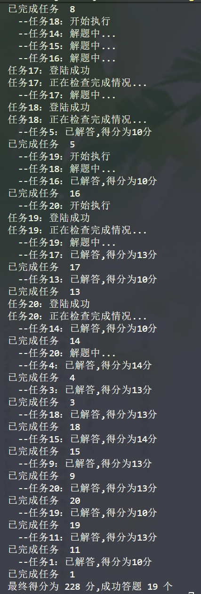

### 重庆邮电大学c语言自动刷题脚本

你是否也被学校无用的c语言刷题所困扰,此脚本可以帮助你解决烦恼    

运行`C语言刷题脚本.exe`即可启动脚本

#### 前置条件

1. 在[火山引擎](https://console.volcengine.com/ark)领取api免费额度,你也可以在ai包里重写InitAi方法来换模型（根据模型的好坏，也有可能得0分）

2. 执行脚本时请确保登录学校内网

#### 使用方法

1. 克隆项目到本地
2. 运行`C语言刷题脚本.exe`
3. 在脚本中输入[火山引擎](https://console.volcengine.com/ark)中你的`API KEY`和`模型ID` （详情见`火山引擎api免费额度领取教程.doc`）
4. 按照提示输入
5. 如遇`fail to start chrome`问题，可尝试重启脚本

#### 效果图

 
